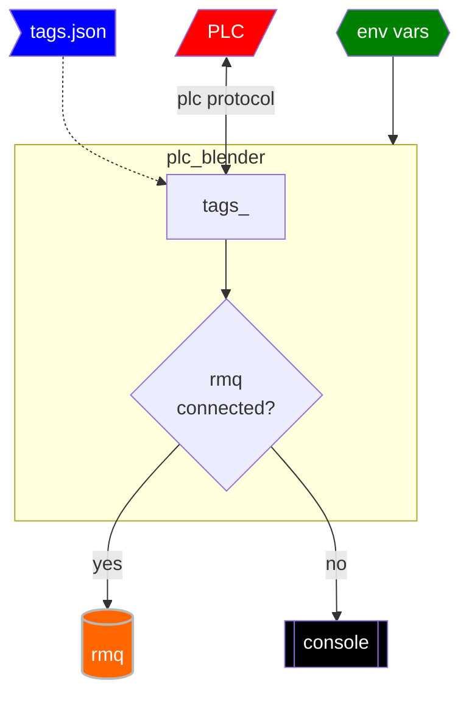
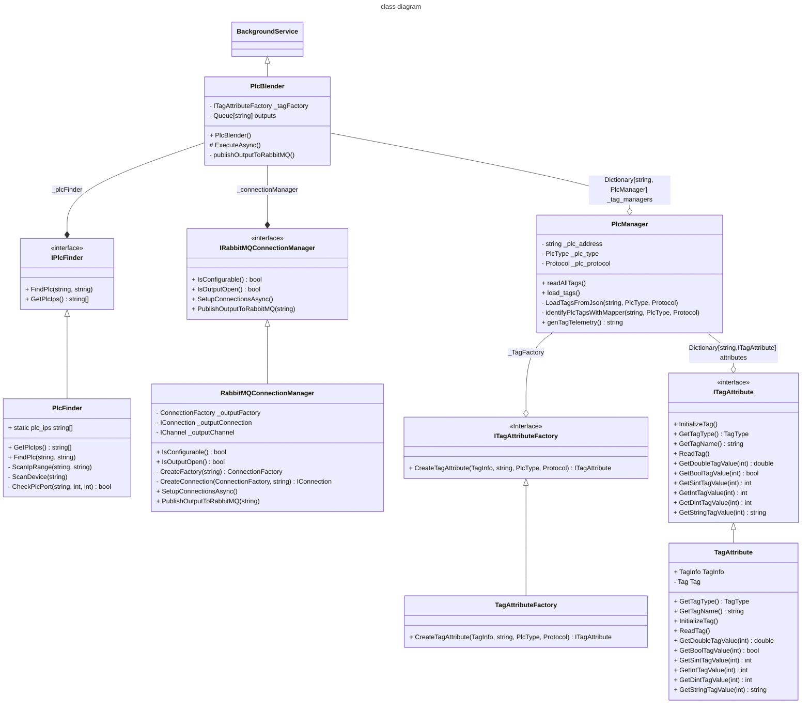

- [1. functionality](#1-functionality)
  - [1.1 functionality](#11-functionality)
  - [1.2 structure](#12-structure)
- [2. use](#2-use)
  - [2.1 environment vars](#21-environment-vars)
  - [2.2 local](#22-local)
  - [2.3 containerization](#23-containerization)
      - [2.3.1 build](#231-build)
      - [2.3.2 run](#232-run)
- [3. requirements](#3-requirements)
- [4. developer notes](#4-developer-notes)

# 1. functionality
## 1.1 functionality


## 1.2 structure


# 2. use

## 2.1 environment vars
see *example.env*
```
PLC_IP=192.168.1.100
PLC_TYPE=ControlLogix
PLC_PROTOCOL=ab_eip
STUB_PLC=false
READ_TAGS_PERIOD_MS=1000
RABBITMQ_HOST=192.168.130.51
RABBITMQ_USER=guest
RABBITMQ_PASS=guest
RABBITMQ_CONNECTION_NAME=plc_blender_output
RABBITMQ_EXCHANGE=plc_data
RABBITMQ_ROUTING_KEY=tag_values
```

## 2.2 local
from root dir
```
dotnet run --project plc_blender
```

## 2.3 containerization
### 2.3.1 build
```
dotnet publish --arch x64 /t:PublishContainer
```

add to `tmvcontainer.azurecr.io` registry with tag `0.0.00000`
```
dotnet publish --arch x64 /t:PublishContainer -p ContainerRegistry=tmvcontainer.azurecr.io -p ContainerImageTag=0.0.00000
```

###  2.3.2 run
```
docker run --env-file .env plc_blender
```

# 3. requirements
Create a C# application using net8.0 that reads tags from an Allen Bradley CompactLogix 5380 over ethernet/IP using the libplctag library.  The tags will be defined in a "tags.json" file which will define the name, datatype, and path for each tag.  Read the tags at a periodic rate defined by the environment variable READ_TAGS_PERIOD_MS.

Print these tags the first time each is identified by the application.

If the RABBITMQ_HOST, RABBITMQ_USER, RABBITMQ_PASS, RABBITMQ_EXCHANGE, and RABBITMQ_ROUTING_KEY environment variables are set, publish the tags and values in a json format.  Add to this message the time-stamp at which the data was received and the application version.  If the RabbitMQ connection is broken, reconnect at a rate defined by the environment variable RABBITMQ_RECONNETION_PERIOD_MS.


# 4. developer notes
- libplctag repo : https://github.com/libplctag/libplctag.NET
- built with `dotnet new console -o query_console -n query_conole`
- https://www.nuget.org/packages/libplctag/
  - example of use